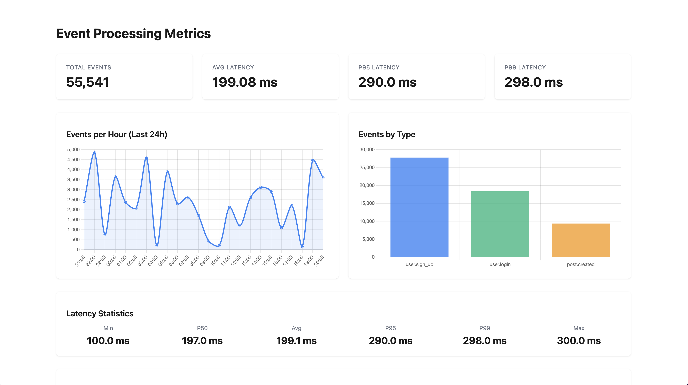
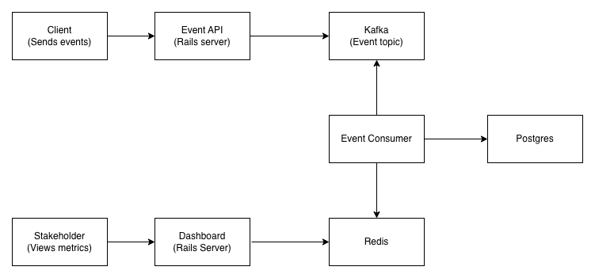

# Event Stream Processor

A demonstration of event-driven architecture using Ruby on Rails, Kafka, and Karafka.



## Overview

This application demonstrates high-throughput event processing patterns:
- Accepts events via REST API
- Publishes to Kafka for asynchronous processing
- Consumes events with Karafka
- Aggregates metrics in real-time with Redis
- Displays dashboard with event statistics

**Built to demonstrate:**
- Event-driven architecture
- Kafka/Karafka integration with Rails
- High-throughput message processing
- Idempotent event handling
- Real-time metrics aggregation

## Tech Stack

- **Backend:** Ruby on Rails 7.x
- **Message Queue:** Apache Kafka
- **Consumer Framework:** Karafka
- **Database:** PostgreSQL
- **Metrics Store:** Redis

## Architecture



Events flow through the system asynchronously, allowing for:
- Decoupled producers and consumers
- Horizontal scalability
- Fault tolerance and replay capability
- Real-time and batch processing

## Features

### Event Ingestion
- REST API endpoint accepts JSON events
- Validates and publishes to Kafka
- Returns immediately (non-blocking)
- Handles high throughput

### Event Processing
- Idempotent consumer (prevents duplicate processing)
- Separate topic for failed events (optimize for throughput)
- Batch processing support

### Metrics & Monitoring
- Real-time event counting by type
- Processing latency tracking
- Dashboard with live updates

## Quick Start

### Prerequisites

- Ruby 3.1+
- Docker & Docker Compose

### Setup

1. **Clone the repository**
```bash
git clone https://github.com/cameron2920/event-stream-processor.git
cd event-stream-processor
```

2. **Start dependencies with Docker**
```bash
docker-compose up -d
```

This starts:
- Kafka
- PostgreSQL
- Redis

3. **Install dependencies**
```bash
bundle install
```

4. **Setup database**
```bash
rails db:create db:migrate db:seed
```

5. **Start the Rails server**
```bash
rails server
```

6. **Start the Karafka consumer** (in another terminal)
```bash
bundle exec karafka server
```

### Send Test Events
```bash
# Send a single event
curl -X POST http://localhost:3000/api/events \
  -H "Content-Type: application/json" \
  -d '{
    "event_type": "user.signup",
    "payload": {
      "user_id": 123,
      "email": "user@example.com"
    }
  }'
```

### View Dashboard

Open http://localhost:3000/dashboard to see:
- Total events processed
- Events by type
- Processing latency
- Recent events

## Project Structure
```
app/
├── controllers/
│   ├── api/events_controller.rb    # REST API for event ingestion
│   └── metrics_controller.rb       # Metric dashboard
├── consumers/
│   └── events_consumer.rb          # Karafka consumer that processes events
├── models/
│   └── event.rb                    # Event model
├── services/
│   ├── metric_report.rb            # Generates data for dashboard
│   └── metric_aggregator.rb        # Real-time metric calculation
```

## Monitoring

The dashboard shows:
- **Event Count:** Total events processed
- **Event Types:** Breakdown by type with charts
- **Processing Rate:** Events/second over time
- **Latency:** p50, p95, p99 processing times

## Production Considerations

This is a **demonstration project**. For production use, things to consider would be:

- [ ] Authentication & authorization
- [ ] Rate limiting and throttling
- [ ] Comprehensive error handling
- [ ] Monitoring & alerting
- [ ] Performance tuning for your workload
- [ ] Security hardening
- [ ] Proper secret management
- [ ] Recalculating Redis metrics after downtime

## Scaling Strategies

To handle higher throughput:

1. **Horizontal Scaling:** Run multiple consumer instances
2. **Partition Strategy:** Increase Kafka topic partitions
3. **Batch Size:** Tune batch sizes for your workload

## Disclaimer

This is a simplified implementation created for demonstration purposes. It showcases technical patterns but is not production-ready without additional hardening, monitoring, and testing.